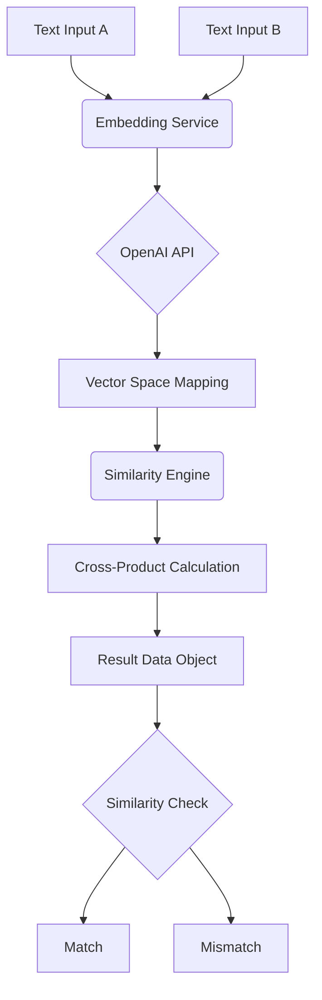

# <p align="center">🤖 Meanly: Semantic Intelligence Engine</p>

<p align="center">
  
</p>

<p align="center">
  
  
  
</p>

<p align="center">
  <i>A high-performance Java engine for Intent Intelligence and Semantic Textual Similarity.</i>
</p>

---

## 🌟 Overview

**Meanly** is a professional-grade Java framework built to solve the failure of traditional keyword-based matching. In the age of Generative AI, matching exact strings is no longer enough—you need to match **meanings**.

Traditional "Lexical Matching" fails when:
- Ideas are expressed using different vocabulary.
- Sentence structures vary significantly.
- Mixed-language or colloquialisms (like **Hinglish**) are used.

**Meanly** solves this by mapping text into a 1536-dimensional mathematical vector space where "meaning" is represented by geometric proximity.

---

## 🧰 Technical Toolbox

The project is strictly built with modern, efficient technologies:

- **☕ Java 17 Records**: Used for immutable, boilerplate-free data models.
- **🐘 Gradle 9.x**: Provides a robust, modern build and testing lifecycle.
- **🧠 OpenAI `text-embedding-3-small`**: Generates high-precision semantic vectors.
- **📐 Cosine Similarity Logic**: The mathematical core that calculates the angular proximity between results.
- **🌐 OkHttp 4**: A modern, high-performance networking stack for REST API communication.
- **🧪 JUnit 5**: Professional-grade unit testing for mathematical validation.
- **✨ Spotless (Google Format)**: Automated style enforcement for a clean, professional codebase.

---

## 🎨 Core Features

- **🧠 Intent Intelligence**: Matches the "Thought" behind the words.
- **🌍 Multilingual Fluidity**: Handles Hinglish and other mixed-language patterns with ease.
- **🛡️ Secure Config**: Zero-risk API key management using a prioritized Environment/Properties fallback.
- **⚡ Lightning Performance**: Optimized vector calculations for real-time validation.

---

## 🏗️ Architecture & Design Patterns

### High-Level Design (HLD)


### Low-Level Design (LLD)
- **`SemanticMatcher`**: The high-level orchestrator.
- **`OpenAIEmbeddingService`**: Handles the transformation of strings to vectors.
- **`CosineSimilarityEngine`**: The mathematical brain for calculating similarity.
- **`ConfigLoader`**: Secure credential management and system configuration.

---

## 🚀 Quick Launch

### 1. Setup Configuration
Create `src/main/resources/meanly.properties` (secured by `.gitignore`):
```properties
openai.api.key=your_secret_key
openai.model=text-embedding-3-small
similarity.threshold=0.75
```

### 2. Execute
```bash
./gradlew clean test
```

---

## 🤝 Community & Extension
Meanly is built to be a reliable foundation for any Java-based NLP or validation project.
1. **Fork** the repo.
2. **Clone** and contribute.
3. Run `./gradlew spotlessApply` to maintain formatting.

---
*Created with ❤️ for the Quality Engineering community by [Abhinav Kumar](https://github.com/abhi9avx)*
