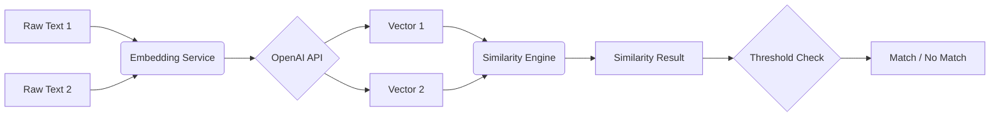

# 🤖 Meanly: Semantic Similarity for Chatbot Validation


**Meanly** is a high-performance, professional-grade Java framework designed for **Semantic Textual Similarity (STS)**. It leverages OpenAI's state-of-the-art embedding models to understand the *intent* and *meaning* behind text, rather than just matching keywords.

---

## 🌟 Why Meanly?

In the world of Generative AI and Chatbots, traditional "equals" or "contains" assertions are obsolete. 
- **"I have $200"** and **"two hundred dollars are in my wallet"** mean the same thing but have 0% keyword overlap.
- **Meanly** solves this by calculating a "Semantic Match," making it perfect for **Automated Chatbot Response Validation**.

---

## 🏗️ Architecture (HLD & LLD)

### High-Level Design (HLD)
The flow starts from raw text and ends with a similarity score calculated in a multi-dimensional vector space.



### Low-Level Design (LLD)
The project follows a clean, decoupled design pattern:
- **`SemanticMatcher`**: The orchestration layer.
- **`OpenAIEmbeddingService`**: Handles remote communication and vector conversion.
- **`CosineSimilarityEngine`**: Performs the mathematical calculations (Dot Product / Norms).
- **`ConfigLoader`**: Manages secure environment settings.

---

## 📁 Project Structure

```text
meanly/
├── src/
│   ├── main/
│   │   ├── java/com/meanly/
│   │   │   ├── config/       # Configuration & Records
│   │   │   ├── embedding/    # OpenAI API Integration
│   │   │   ├── matcher/      # Main Orchestrator
│   │   │   ├── model/        # Result Data Structures
│   │   │   └── similarity/   # Mathematical Engines
│   │   └── resources/
│   │       └── meanly.properties  # [IGNORED] Local Settings
│   └── test/                 # JUnit 5 Test Suite
├── build.gradle              # Dependency & Spotless Config
└── .env                      # [IGNORED] API Credentials
```

---

## 🚀 Getting Started

### 1. Prerequisites
- Java 17+
- OpenAI API Key

### 2. Setup
Clone the repo and create your local config:
```bash
git clone https://github.com/your-username/meanly.git
cd meanly
```

Create a `src/main/resources/meanly.properties` file:
```properties
openai.api.key=your_sk_key_here
openai.model=text-embedding-3-small
similarity.threshold=0.75
```

### 3. Run Tests
```bash
./gradlew test
```

---

## 💡 Usage Example

```java
SemanticMatcher matcher = new SemanticMatcher();

// These sentences have the same meaning but different words
String expected = "Your balance is 2 Lakhs";
String actual = "aapke account mai two hundred thousand rupyaa hai";

SimilarityResult result = matcher.compare(expected, actual);

if (matcher.isMatch(result)) {
    System.out.println("✅ Semantic Match Found! Score: " + result.similarity());
}
```

---

## 🛠️ Tech Stack & Features
- **Java 17 Records**: Minimal boilerplate, clean data models.
- **OpenAI Embeddings**: Industry-standard vector generation.
- **Spotless & Google Java Format**: Guaranteed 100% clean code style.
- **OkHttp 4**: Robust, modern networking.
- **Mermaid Diagrams**: Interactive architectural visualization.

---

## 🤝 Contributing & Forking
1. **Fork** the repository.
2. Create your **Feature Branch**.
3. Run `./gradlew spotlessApply` to ensure formatting matches.
4. Open a **Pull Request**.

---

## 🗺️ Roadmap
- [ ] Support for Local LLMs (Ollama Integration).
- [ ] Batch processing for large datasets.
- [ ] Support for Jaccard and Euclidean distances.

---
*Created with ❤️ by [Abhinav Kumar](https://github.com/abhi9avx)*
